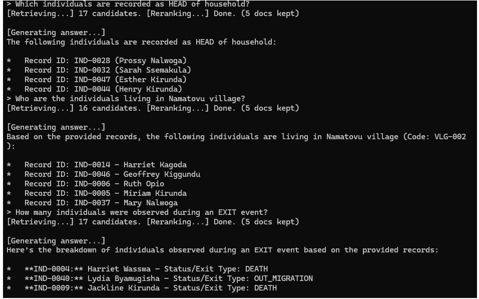

# RAG Pipeline — HDSS Demographic Data

[](https://opensource.org/licenses/MIT)
[](https://www.python.org/)
[](https://ollama.com)
[](https://ollama.com/library/nomic-embed-text)
[](https://ollama.com/library/gemma3)
[](https://huggingface.co/cross-encoder/ms-marco-MiniLM-L-6-v2)
[](https://ollama.com)

A local, privacy-preserving Retrieval-Augmented Generation (RAG) system for querying Health and Demographic Surveillance System (HDSS) data using natural language.

All inference runs fully offline via [Ollama](https://ollama.com) — no cloud API calls, no data leaves your machine.

---

## Demo



*The system retrieving and answering questions about household roles, village residents, and exit observations — showing the retrieve → rerank → generate pipeline in action.*

---

## How It Works

```
User Query
  ↓
Stage 1 — Hybrid Retrieval (wide net)
  ├── Semantic search  (ChromaDB + nomic-embed-text)  →  10 candidates
  └── Keyword search   (exact word matching)           →  up to 10 more
  ↓
Stage 2 — Reranking
  └── CrossEncoder (ms-marco-MiniLM-L-6-v2) scores each candidate
      and keeps the top 5
  ↓
Stage 3 — Generation
  └── Local LLM (gemma3:4b via Ollama) answers using the 5 best docs
  ↓
Streamed response
```

- **Hybrid retrieval** ensures both conceptual queries ("who migrated for health reasons?") and name-specific lookups ("date of birth for Miriam Kirunda?") surface the right candidates.
- **Reranking** re-scores every candidate against the exact query using a cross-encoder, so only the most relevant docs reach the LLM — reducing noise and hallucination.

---

## Requirements

### Python packages
```bash
pip install chromadb ollama sentence-transformers
```

### Ollama models
Install [Ollama](https://ollama.com/download), then pull the required models:
```bash
ollama pull nomic-embed-text
ollama pull gemma3:4b
```

---

## Usage

Run from the project root:
```bash
python main.py
```

On first run, all 50 records are embedded and stored in `chroma_db/` (takes ~30 seconds). Subsequent runs skip this step.

**Example queries:**
```
> what is the date of birth for miriam kirunda?
> what is the other name for patrick nansubuga?
> list all female records in the dataset
> who migrated from Kampala?
> which individuals have an exit type of DEATH?
```

Type `exit` or `quit` to stop.

---

## Project Structure

```
├── main.py                      # RAG pipeline
├── Data/
│   └── hdss_synthetic_50.jsonl  # 50 synthetic HDSS records
├── chroma_db/                   # Vector store (auto-generated, git-ignored)
└── .gitignore
```

---

## Data

The dataset contains 50 synthetic HDSS records with the following fields:

| Field | Description |
|-------|-------------|
| `id` | Unique individual ID (e.g. IND-0001) |
| `name` / `surname` | First and last name |
| `other_name1` | Middle / other name |
| `gender` | M / F |
| `dob` | Date of birth |
| `village_name` / `village_code` | Village of residence |
| `hh_relation` | Household relationship (HEAD, PARENT, SIBLING, etc.) |
| `exit_type` | LOSS_TO_FOLLOWUP, DEATH, or null (Active) |
| `entry_type` / `exit_type` | Migration event types |
| `province` / `move_place` | Migration origin/destination |

---

## Configuration

Key constants in `main.py`:

| Constant | Default | Description |
|----------|---------|-------------|
| `EMBED_MODEL` | `nomic-embed-text:latest` | Ollama embedding model |
| `RERANK_MODEL` | `cross-encoder/ms-marco-MiniLM-L-6-v2` | HuggingFace cross-encoder for reranking |
| `LLM_MODEL` | `gemma3:4b` | Ollama chat model |
| `N_SEMANTIC` | `10` | Candidate docs from semantic search |
| `N_KEYWORD` | `10` | Candidate docs added via keyword matching |
| `N_FINAL` | `5` | Docs kept after reranking (sent to LLM) |
| `DATA_FILE` | `Data/hdss_synthetic_50.jsonl` | Input data path |

---

## Notes

- If `OLLAMA_HOST` is set to `0.0.0.0` (server bind address), the pipeline automatically remaps it to `127.0.0.1` for the Python client.
- The `chroma_db/` directory is git-ignored. Delete it to force a full re-embedding (e.g. after changing the document format).

---

## Potential Future Updates

- **Narrative-based embeddings** — `Data/Narative Data/hdss_synthetic_50_narratives.jsonl` contains full prose descriptions for each record (migration history, household context, observation events). Switching the pipeline to embed these narratives instead of the structured field format would improve semantic retrieval quality, especially for open-ended conceptual queries.
- **Larger dataset support** — extend ingestion to handle thousands of records with chunking and metadata filtering.
- **Web UI** — add a Gradio or Streamlit front-end for non-technical users.
- ~~**Reranking** — add a cross-encoder reranker step between retrieval and generation for higher answer accuracy.~~ ✅ Done
